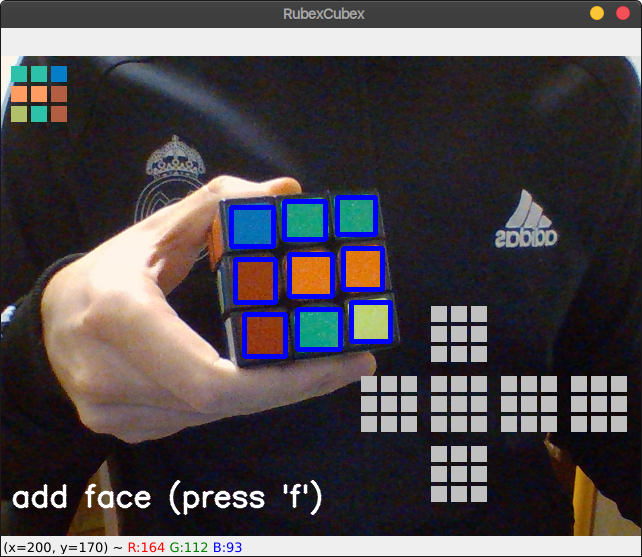
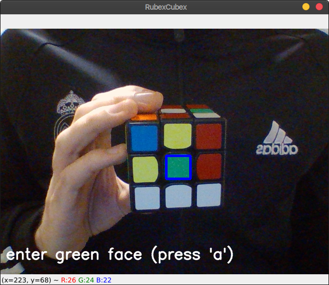

# rubex-cubex
Rubex-Cubex is a Rubik's cube detector and solver. It uses neural network with deep reinfocement learning to solve various states that the user inputs using their webcam and keyboard.
## Running the project
---
### Requirements
All the dependencies listed in the <em>requirements.txt</em> file have to be installed, preferably inside an enviroment created with venv specifically for Rubex-Cubex. <br>

To install the requirements enter the following command in your terminal:
<br>
```console
pip install -r requirements.txt
``` 
The application also requires a working webcam. 

### Using the application
---
To run the main application start the main.py file inside the face-recognition folder:
```console
python main.py
```
When the application runs the user is promted with a message on how to enter the detected faces of the Rubik's cube in frame. As soon as the application detects a Rubik's cube face it shows a preview of the colors it has read.

<p align="center">

</p>

If the user is not satisfied with the predefined color values, they can calibrate the colors their colors according to their Rubik's cube. 

<p align="center">

</p>

## Developers
---
-   Dalibor Malić, SW-50/2018
-   Darko Tica, SW-22/2018
-   Zoran Jankov, SW-8/2018
